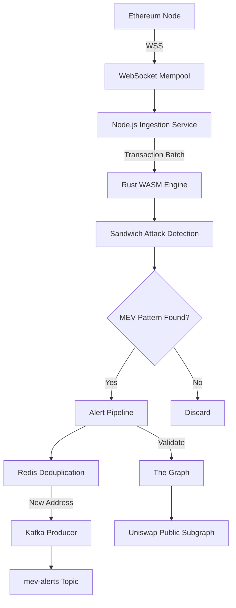

# MEV-Bot Detector with Real-Time Alert System

This project is a production-grade backend service designed to detect MEV (Maximal Extractable Value) sandwich attacks on the Ethereum blockchain in real-time. It listens to the mempool, uses a high-performance Rust core (compiled to WASM) for detection, and streams alerts through a Kafka pipeline with Redis-based deduplication.

## 🏛️ Architecture

The system is designed as a series of microservices and components that form a real-time data processing pipeline.



## ✨ Features

-   **Real-Time Mempool Scanning**: Connects to an Ethereum node via WebSockets to process pending transactions as they happen.
-   **High-Performance Detection Core**: Utilizes a Rust-based WebAssembly (WASM) module for CPU-intensive sandwich attack analysis, ensuring the Node.js event loop remains unblocked.
-   **Sandwich Attack Logic**: Detects attacks by analyzing transaction ordering, gas price premiums, and asset flow (A->B->A pattern).
-   **Historical Validation**: Queries The Graph's public Uniswap subgraph to check if a potential attacker has a history of suspicious activity.
-   **Scalable Alerting Pipeline**: Publishes confirmed alerts to a Kafka topic, allowing multiple downstream services to consume them.
-   **Intelligent Deduplication**: Uses Redis with a 5-minute TTL to prevent spamming alerts for the same attacker.
-   **Production-Ready**: Features structured logging, configuration via environment variables, graceful shutdown, and robust error handling.

## 🛠️ Technology Stack

-   **Backend**: Node.js
-   **Core Logic**: Rust / WebAssembly (WASM)
-   **Messaging/Streaming**: Apache Kafka
-   **Cache/Deduplication**: Redis
-   **Blockchain Data**: Ethers.js, The Graph (Public Subgraph)
-   **Infrastructure**: Docker & Docker Compose
-   **Tooling**: `wasm-pack`, `pino` (logging), `dotenv` (config)

## Prerequisites

Before you begin, ensure you have the following installed:

-   [**Node.js**](https://nodejs.org/) (v18.x or later)
-   [**Docker**](https://www.docker.com/) and [**Docker Compose**](https://docs.docker.com/compose/)
-   **Rust & Cargo**:
    ```bash
    curl --proto '=https' --tlsv1.3 -sSf https://sh.rustup.rs | sh
    ```
-   **WASM-Pack**:
    ```bash
    cargo install wasm-pack
    ```

## 🚀 Getting Started

Follow these steps to get the project running locally.

### 1. Clone the Repository

```bash
git clone https://github.com/devansh0703/mev-bot-detector
cd mev-bot-detector
```

### 2. Build the Rust/WASM Engine

Compile the Rust detection logic into a Node.js-compatible WebAssembly module.

```bash
cd packages/rust-engine
wasm-pack build --target nodejs --out-dir ../../services/backend/pkg
cd ../../
```
This command places the compiled package directly into the backend service directory.

### 3. Configure the Backend Service

The backend is configured using environment variables.

```bash
# Navigate to the backend service
cd services/backend

# Create a .env file from the example
cp .env.example .env
```

Now, **edit the `.env` file** and add your Ethereum node WebSocket URL from a provider like [Infura](https://infura.io/) or [Alchemy](https://www.alchemy.com/).

```env
WSS_URL="wss://mainnet.infura.io/ws/v3/YOUR_PROJECT_ID"
```

### 4. Install Node.js Dependencies

```bash
# Make sure you are in the services/backend directory
npm install
```

### 5. Start the Infrastructure

In the project's root directory, start the Kafka and Redis containers using Docker Compose.

```bash
# From the root mev-bot-detector/ directory
docker-compose up -d
```

## 🏃 Running the Application

### 1. Start the MEV Detector Service

Navigate to the backend service directory and run the `start` script.

```bash
# In services/backend/
npm start
```

The service will start, connect to all services, and begin listening silently to the mempool. The terminal will look like this:

```
[13:54:07.520] INFO: 🎧 Listening for pending transactions...
    batchSize: 150
    interval: 1000
```

### 2. Monitor for Alerts

When the service detects an attack, it sends a message to the `mev-alerts` Kafka topic. To see these alerts, open a **new terminal** and run the following command to start a Kafka consumer:

```bash
docker exec -it kafka /opt/kafka/bin/kafka-console-consumer.sh --bootstrap-server localhost:9092 --topic mev-alerts --from-beginning
```

This terminal will remain blank until an alert is sent.

### 3. Run the Load Test (Optional)

To verify that the entire Kafka pipeline is working correctly, you can run a load test script that simulates 10,000 alerts.

Open a **third terminal**, navigate to `services/backend`, and run:

```bash
npm run test:load
```

You will see the consumer terminal instantly fill with the mock alert messages, confirming the pipeline is functional.

## 📁 Project Structure

```
mev-bot-detector/
├── packages/
│   └── rust-engine/          # The Rust/WASM detection core
│       ├── src/lib.rs        # Core sandwich attack detection logic
│       └── Cargo.toml
└── services/
    └── backend/              # The main Node.js service
        ├── pkg/              # Compiled WASM output (from wasm-pack)
        ├── .env              # Local environment configuration (secret)
        ├── .env.example      # Example environment configuration
        ├── config.js         # Configuration loader
        ├── index.js          # Main application entrypoint
        ├── logger.js         # Pino structured logger setup
        ├── load-test.js      # Kafka load testing script
        └── package.json
├── docker-compose.yml        # Defines Kafka and Redis services
└── README.md                 # This file
```
